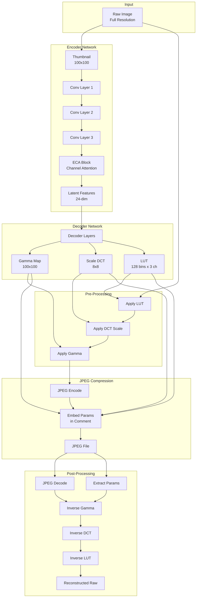
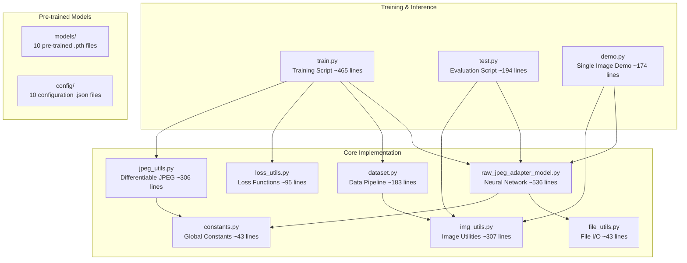
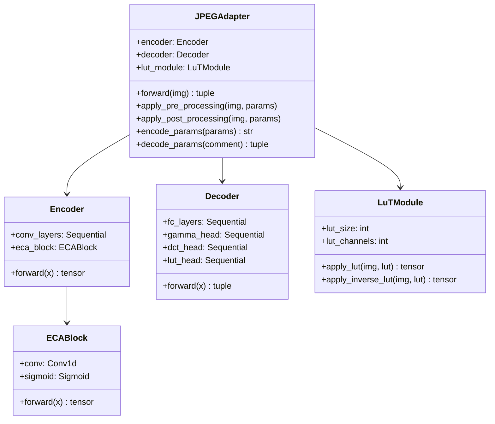
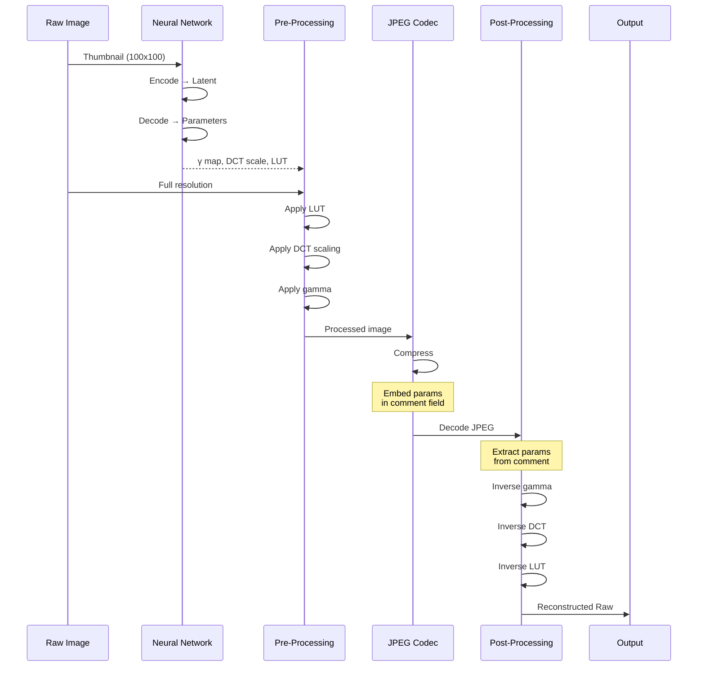
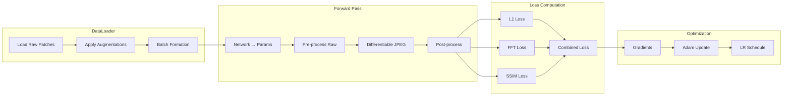

# Raw-JPEG Adapter Documentation

## Overview

**Raw-JPEG Adapter** is a research project that implements a lightweight, learnable preprocessing pipeline for efficient raw image compression using standard JPEG. The key innovation is embedding transformation parameters in the JPEG comment field, enabling accurate raw reconstruction after JPEG decoding.

### Key Features

- **Lightweight Neural Network**: ~37K parameters
- **Embedded Parameters**: Transformation parameters stored in JPEG comment (<64 KB)
- **Multiple Quality Levels**: Support for JPEG quality 25, 50, 75, 95, and 100
- **Optional DCT Processing**: Frequency-domain scaling for improved quality
- **End-to-End Training**: Differentiable JPEG simulation enables gradient-based optimization

### Authors

- Mahmoud Afifi, Ran Zhang, Michael S. Brown
- Samsung Electronics (AI Center-Toronto)
- [arXiv:2509.19624](https://arxiv.org/abs/2509.19624)

---

## Architecture Overview



---

## Code Structure



### File Descriptions

| File | Purpose | Lines |
|------|---------|-------|
| `raw_jpeg_adapter_model.py` | Main neural network (JPEGAdapter, Encoder, Decoder, LuTModule, ECABlock) | ~536 |
| `dataset.py` | PyTorch Dataset with HDF5 caching and augmentations | ~183 |
| `loss_utils.py` | L1, FFT, and SSIM loss functions | ~95 |
| `jpeg_utils.py` | Differentiable JPEG encoder/decoder for training | ~306 |
| `img_utils.py` | Image I/O, DNG handling, demosaicing, metrics | ~307 |
| `file_utils.py` | File/directory utilities | ~43 |
| `constants.py` | Global constants, JPEG tables, model paths | ~43 |
| `train.py` | Training loop with TensorBoard logging | ~465 |
| `test.py` | Evaluation with comprehensive metrics | ~194 |
| `demo.py` | Single-image inference demonstration | ~174 |

---

## Neural Network Components



### Transformation Parameters

| Parameter | Shape | Purpose |
|-----------|-------|---------|
| **Gamma Map** | 100×100 | Spatial pixel-wise gamma correction |
| **Scale DCT** | 8×8 | Global frequency domain scaling |
| **LUT** | 128×3 | Per-channel tone mapping curves |

---

## Data Flow



---

## Training Pipeline



---

## Loss Functions

### Combined Loss Formula

```
L_total = w_1 × L_1(x, x̂) + w_fft × L_fft(x, x̂) + w_ssim × (1 - SSIM(x, x̂))
```

Where:
- `L_1`: Pixel-wise absolute difference
- `L_fft`: Frequency domain matching (FFT real + imaginary)
- `SSIM`: Structural Similarity Index

### Default Weights
- `w_1 = 1.0`
- `w_fft = 0.1`
- `w_ssim = 0.1`

---

## Pre-trained Models

The project provides 10 pre-trained models for different configurations:

| Quality | With DCT | Without DCT |
|---------|----------|-------------|
| Q=25 | `raw_jpeg_adapter_q_25_w_dct.pth` | `raw_jpeg_adapter_q_25_wo_dct.pth` |
| Q=50 | `raw_jpeg_adapter_q_50_w_dct.pth` | `raw_jpeg_adapter_q_50_wo_dct.pth` |
| Q=75 | `raw_jpeg_adapter_q_75_w_dct.pth` | `raw_jpeg_adapter_q_75_wo_dct.pth` |
| Q=95 | `raw_jpeg_adapter_q_95_w_dct.pth` | `raw_jpeg_adapter_q_95_wo_dct.pth` |
| Q=100 | `raw_jpeg_adapter_q_100_w_dct.pth` | `raw_jpeg_adapter_q_100_wo_dct.pth` |

---

## Configuration Format

Each model has a corresponding JSON configuration:

```json
{
    "latent_dim": 24,
    "map_size": [100, 100],
    "eca": true,
    "gamma": true,
    "scale_dct": true,
    "lut": true,
    "lut_size": 128,
    "lut_channels": 3,
    "quality": 75
}
```

---

## Directory Structure

```
raw-jpeg-adapter/
├── README.md                    # Project overview
├── LICENSE.md                   # CC BY-NC-SA 4.0
├── requirements.txt             # Python dependencies
├── constants.py                 # Global constants
│
├── models/                      # Pre-trained weights
│   └── *.pth                    # 10 model files
│
├── config/                      # Model configurations
│   └── *.json                   # 10 config files
│
├── docs/                        # Documentation
│   ├── README.md                # This file
│   ├── USAGE.md                 # Usage guide
│   └── RESEARCH_IDEAS.md        # Future research
│
├── raw_jpeg_adapter_model.py    # Neural network
├── dataset.py                   # Data loading
├── loss_utils.py                # Loss functions
├── jpeg_utils.py                # Differentiable JPEG
├── img_utils.py                 # Image utilities
├── file_utils.py                # File utilities
│
├── train.py                     # Training script
├── test.py                      # Evaluation script
└── demo.py                      # Inference demo
```

---

## References

- **Paper**: [Raw-JPEG Adapter: Efficient Raw Image Compression with JPEG](https://arxiv.org/abs/2509.19624)
- **License**: CC BY-NC-SA 4.0 (Non-commercial use only)

```bibtex
@article{afifi2025raw,
  title={Raw-JPEG Adapter: Efficient Raw Image Compression with JPEG},
  author={Afifi, Mahmoud and Zhang, Ran and Brown, Michael S},
  journal={arXiv preprint arXiv:2509.19624},
  year={2025}
}
```
