# Research Improvements & Future Directions

This document analyzes potential improvements to the Raw-JPEG Adapter codebase and proposes new research directions.

---

## Table of Contents

1. [Current Limitations Analysis](#current-limitations-analysis)
2. [Code/Implementation Improvements](#codeimplementation-improvements)
3. [Architecture Improvements](#architecture-improvements)
4. [New Research Directions](#new-research-directions)
5. [Experimental Ideas](#experimental-ideas)

---

## Current Limitations Analysis

### 1. Fixed Parameter Size

**Current State:**
- Gamma map: Fixed 100×100
- DCT scale: Fixed 8×8
- LUT: Fixed 128 bins × 3 channels

**Limitation:**
- Parameters don't adapt to image complexity
- Simple images waste space; complex images may be under-parameterized

### 2. Single-Scale Processing

**Current State:**
- Thumbnail processed at single resolution (100×100)
- No multi-scale feature extraction

**Limitation:**
- May miss both fine details and global context
- Limited receptive field in encoder

### 3. Quality-Specific Models

**Current State:**
- Separate model for each JPEG quality level
- 10 different models to maintain

**Limitation:**
- No interpolation between quality levels
- Cannot handle arbitrary quality values

### 4. Global LUT Limitation

**Current State:**
- Single global LUT applied uniformly

**Limitation:**
- Different image regions may need different tone mappings
- Shadows and highlights not treated separately

### 5. Camera-Specific Training

**Current State:**
- Models trained on specific camera data (Samsung S24 Ultra)

**Limitation:**
- May not generalize well to other cameras
- Different sensor characteristics not accounted for

---

## Code/Implementation Improvements

### 1. Mixed Precision Training

```python
# Current: Full precision
# Proposed: Use torch.cuda.amp for faster training

from torch.cuda.amp import autocast, GradScaler

scaler = GradScaler()

with autocast():
    output = model(input)
    loss = criterion(output, target)

scaler.scale(loss).backward()
scaler.step(optimizer)
scaler.update()
```

**Benefits:**
- 2-3x faster training
- Reduced memory footprint
- Enables larger batch sizes

### 2. Distributed Training Support

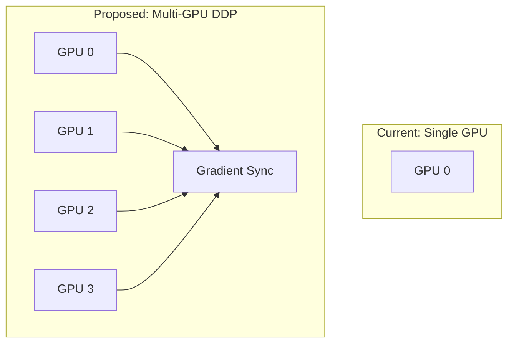

**Implementation:**
- Add `torch.nn.parallel.DistributedDataParallel` support
- Implement proper gradient synchronization
- Add multi-node training capability

### 3. Efficient Data Loading

**Current Issues:**
- HDF5 files created per-batch (fragmented)
- LRU cache limited to 64 files

**Proposed Improvements:**
```python
# Use WebDataset for streaming
import webdataset as wds

dataset = (
    wds.WebDataset("data/train-{000..099}.tar")
    .decode("pil")
    .to_tuple("input.png", "target.png")
    .batched(batch_size)
)
```

### 4. ONNX/TensorRT Export

**Add inference optimization:**
```python
# Export to ONNX
torch.onnx.export(
    model,
    dummy_input,
    "raw_jpeg_adapter.onnx",
    opset_version=14,
    dynamic_axes={'input': {0: 'batch', 2: 'height', 3: 'width'}}
)

# Convert to TensorRT for deployment
# trtexec --onnx=raw_jpeg_adapter.onnx --saveEngine=model.trt
```

### 5. Better Logging & Experiment Tracking

**Add Weights & Biases integration:**
```python
import wandb

wandb.init(project="raw-jpeg-adapter")
wandb.config = {
    "learning_rate": args.lr,
    "epochs": args.epochs,
    "batch_size": args.batch_size
}

# Log metrics
wandb.log({
    "loss": loss.item(),
    "psnr": psnr,
    "ssim": ssim
})

# Log images
wandb.log({"reconstructed": wandb.Image(output)})
```

---

## Architecture Improvements

### 1. Multi-Scale Encoder

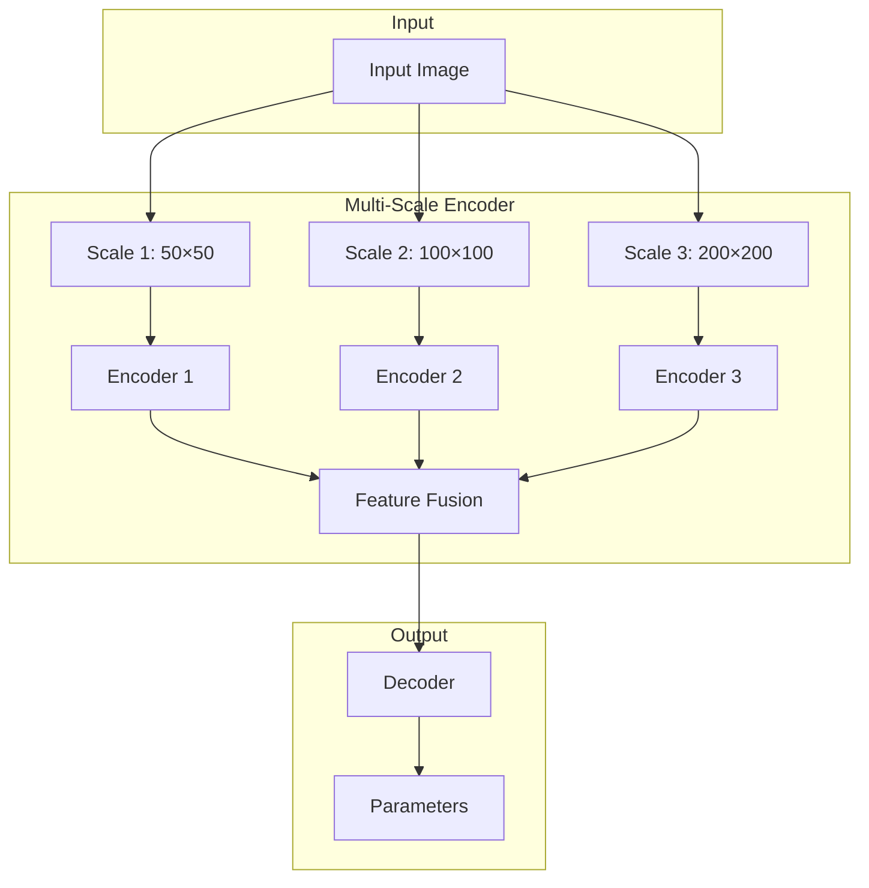

**Benefits:**
- Captures both local and global features
- Better handling of varied image content
- Improved robustness

### 2. Attention-Based Parameter Prediction

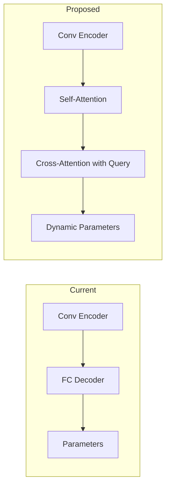

**Implementation Concept:**
```python
class AttentionDecoder(nn.Module):
    def __init__(self, latent_dim, num_heads=4):
        super().__init__()
        self.self_attn = nn.MultiheadAttention(latent_dim, num_heads)
        self.cross_attn = nn.MultiheadAttention(latent_dim, num_heads)

    def forward(self, features, spatial_query):
        # Self-attention on features
        attended, _ = self.self_attn(features, features, features)
        # Cross-attention with spatial queries
        output, attn_weights = self.cross_attn(spatial_query, attended, attended)
        return output, attn_weights
```

### 3. Spatially-Varying LUT

**Current:** Single global 1D LUT
**Proposed:** Spatial LUT prediction

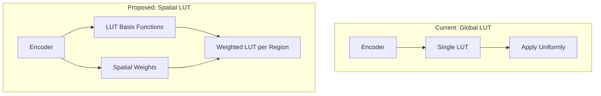

**Benefits:**
- Region-adaptive tone mapping
- Better highlight/shadow handling
- Improved local contrast

### 4. Quality-Conditioned Model

**Replace multiple models with single conditioned model:**

```python
class QualityConditionedAdapter(nn.Module):
    def __init__(self, base_dim=24):
        super().__init__()
        self.quality_embed = nn.Embedding(5, base_dim)  # 5 quality levels
        self.encoder = Encoder(base_dim)
        self.decoder = Decoder(base_dim * 2)  # Concatenate quality embedding

    def forward(self, x, quality_level):
        q_embed = self.quality_embed(quality_level)
        features = self.encoder(x)
        conditioned = torch.cat([features, q_embed], dim=-1)
        return self.decoder(conditioned)
```

**Benefits:**
- Single model for all quality levels
- Potential for continuous quality interpolation
- Reduced model storage requirements

### 5. Transformer-Based Architecture

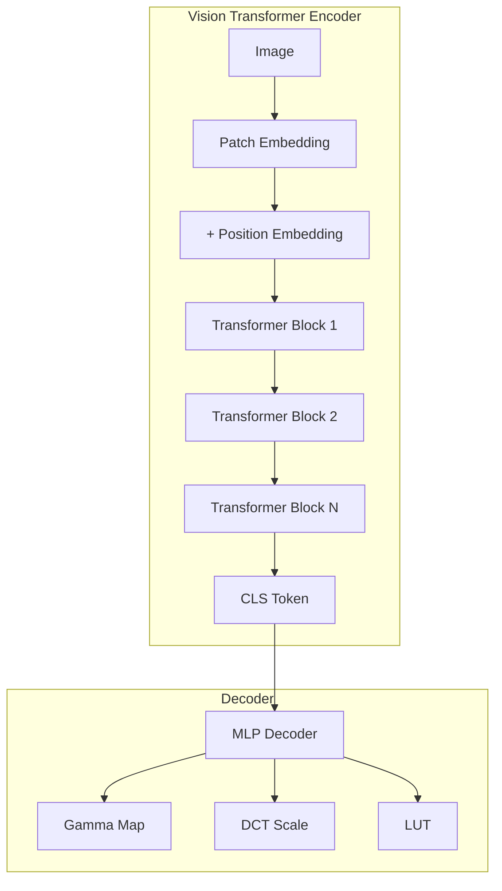

**Potential Benefits:**
- Global context from first layer
- Better parameter efficiency
- Pre-training on large datasets

---

## New Research Directions

### 1. Learned JPEG Quantization Tables

**Idea:** Learn custom quantization tables jointly with adapter

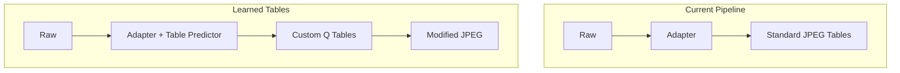

**Research Questions:**
- Can learned tables improve rate-distortion?
- How to ensure backward compatibility?
- Joint optimization of adapter and tables

### 2. Neural Compression Backend

**Replace JPEG with learned compression:**

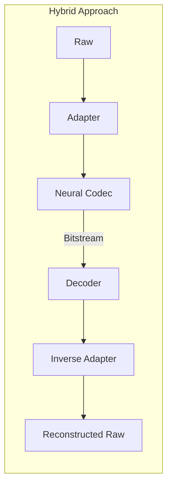

**Potential Codecs:**
- **ELIC**: Efficient Learned Image Compression
- **Hyperprior**: Variational Image Compression
- **VVC Intra**: Traditional but efficient

**Research Questions:**
- Optimal division between adapter and codec
- End-to-end joint training
- Rate-distortion-complexity tradeoffs

### 3. Raw-to-Raw Compression Without Demosaicing

**Current:** Demosaic → Adapt → JPEG → Reconstruct
**Proposed:** Compress Bayer pattern directly

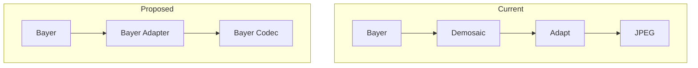

**Benefits:**
- Preserve original sensor data
- Better reconstruction of fine details
- No demosaicing artifacts

### 4. Metadata-Aware Adaptation

**Incorporate camera metadata into adaptation:**

```python
class MetadataConditionedAdapter(nn.Module):
    def __init__(self):
        self.iso_embed = nn.Embedding(10, 16)      # ISO levels
        self.aperture_embed = nn.Embedding(8, 16)  # Aperture settings
        self.wb_mlp = nn.Linear(3, 16)             # White balance
        # ... combine with image features
```

**Metadata to Consider:**
- ISO sensitivity (noise characteristics)
- White balance coefficients
- Black/white levels
- Lens information
- Exposure settings

### 5. Perceptual Loss for Raw Images

**Problem:** Standard perceptual losses designed for sRGB

**Research Direction:** Develop raw-specific perceptual metrics

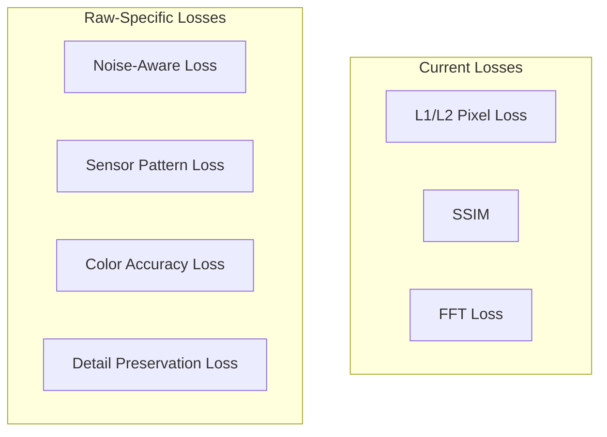

**Ideas:**
- Train a "Raw VGG" network for perceptual features
- Noise-aware loss that accounts for shot noise
- Color accuracy in sensor color space

### 6. Generative Enhancement

**Combine compression with enhancement:**

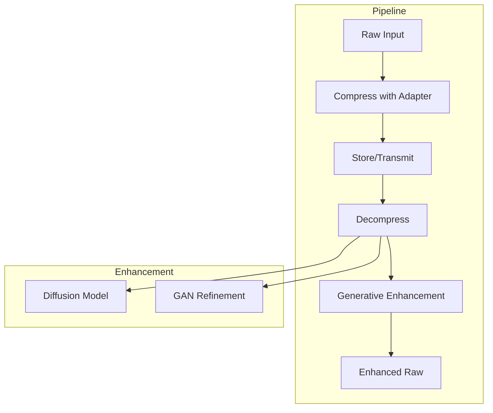

**Research Questions:**
- Can we recover details lost in compression?
- Conditional generation from compressed representation
- Trade-off between fidelity and enhancement

---

## Experimental Ideas

### 1. Ablation Studies to Conduct

| Component | Experiment | Hypothesis |
|-----------|------------|------------|
| ECA Block | Remove/modify attention | May be redundant for small latent |
| LUT Size | Vary 64-512 bins | Diminishing returns above 128 |
| Map Size | Vary 50-200 | Optimal around 100 |
| DCT Scale | Per-channel vs. global | Per-channel may help color |
| Loss Weights | Systematic grid search | Dataset-dependent optimal |

### 2. Cross-Camera Generalization

**Experiment Design:**
```
Training: Camera A raw images
Testing: Camera B, C, D raw images

Metrics:
- PSNR degradation
- Color shift measurement
- Detail preservation
```

**Research Questions:**
- Domain adaptation techniques for camera transfer
- Camera-agnostic feature learning
- Few-shot adaptation to new cameras

### 3. Extreme Compression Regime

**Push to lower quality levels:**
- JPEG Quality 10-20
- Investigate failure modes
- Develop specialized low-quality adapters

### 4. Video Extension

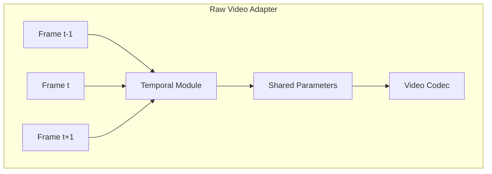

**Considerations:**
- Temporal consistency of parameters
- Keyframe vs. predicted frame parameters
- Motion-compensated parameter prediction

### 5. Progressive Transmission

**Enable progressive raw image transmission:**

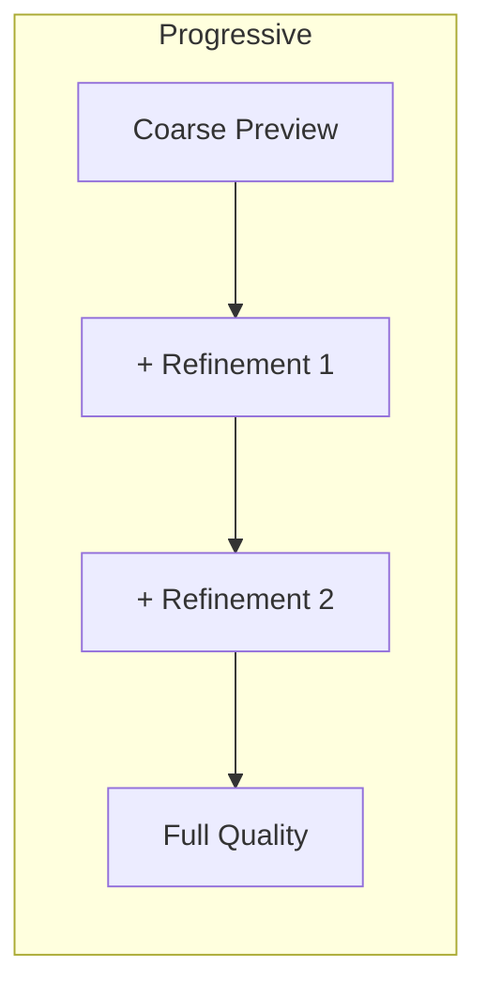

**Implementation:**
- Hierarchical parameter encoding
- Progressive parameter transmission
- Early decoding at any stage

---

## Implementation Priority Matrix

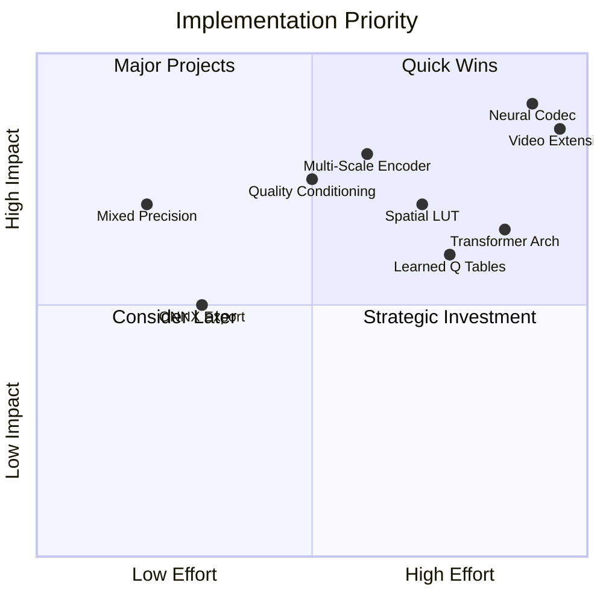

### Recommended Priority Order

1. **Immediate (Low effort, High impact):**
   - Mixed precision training
   - ONNX/TensorRT export
   - Better experiment tracking

2. **Short-term (Medium effort, High impact):**
   - Quality-conditioned single model
   - Multi-scale encoder
   - Cross-camera experiments

3. **Medium-term (High effort, High impact):**
   - Spatial LUT implementation
   - Learned quantization tables
   - Perceptual loss development

4. **Long-term (Research projects):**
   - Neural compression backend
   - Video extension
   - Generative enhancement

---

## Conclusion

The Raw-JPEG Adapter presents a strong foundation with significant room for improvement. Key opportunities include:

1. **Efficiency**: Mixed precision, distributed training, export optimization
2. **Architecture**: Multi-scale, attention, quality conditioning
3. **Research**: Neural codecs, learned tables, perceptual metrics
4. **Applications**: Video, progressive transmission, cross-camera

The modular codebase makes many of these improvements tractable without major refactoring.

---

## References for Further Reading

1. **Learned Image Compression:**
   - Ballé et al., "Variational Image Compression with a Scale Hyperprior"
   - Cheng et al., "Learned Image Compression with Discretized Gaussian Mixture"

2. **Raw Image Processing:**
   - Brooks et al., "Unprocessing Images for Learned Raw Denoising"
   - Ignatov et al., "Replacing Mobile Camera ISP with a Single Deep Learning Model"

3. **Efficient Networks:**
   - Howard et al., "MobileNets: Efficient Convolutional Neural Networks"
   - Tan & Le, "EfficientNet: Rethinking Model Scaling"

4. **Attention Mechanisms:**
   - Dosovitskiy et al., "An Image is Worth 16x16 Words: Transformers for Image Recognition"
   - Wang et al., "Non-local Neural Networks"
