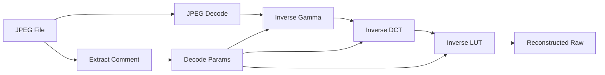
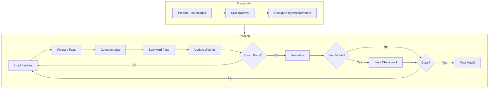
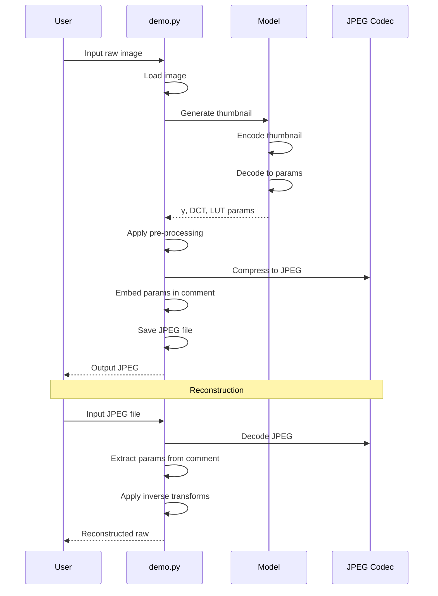
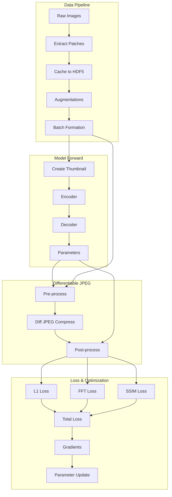

# Raw-JPEG Adapter Usage Guide

## Table of Contents

1. [Installation](#installation)
2. [Quick Start](#quick-start)
3. [Inference/Demo](#inferencedemo)
4. [Training](#training)
5. [Testing/Evaluation](#testingevaluation)
6. [Advanced Configuration](#advanced-configuration)

---

## Installation

### Prerequisites

- Python 3.8+
- CUDA-capable GPU (recommended)
- ~4GB GPU memory for training

### Step 1: Clone the Repository

```bash
git clone https://github.com/your-repo/raw-jpeg-adapter.git
cd raw-jpeg-adapter
```

### Step 2: Create Virtual Environment (Recommended)

```bash
python -m venv venv
source venv/bin/activate  # Linux/macOS
# or
venv\Scripts\activate     # Windows
```

### Step 3: Install PyTorch

Install PyTorch with CUDA support (adjust for your CUDA version):

```bash
# CUDA 12.1
pip install torch torchvision torchaudio --index-url https://download.pytorch.org/whl/cu121

# CUDA 11.8
pip install torch torchvision torchaudio --index-url https://download.pytorch.org/whl/cu118

# CPU only
pip install torch torchvision torchaudio
```

### Step 4: Install Dependencies

```bash
pip install -r requirements.txt
```

---

## Quick Start

### Compress a Raw Image

```bash
python demo.py --input-file /path/to/image.dng --jpeg-quality 75
```

### Compress with DCT Enhancement (Samsung S24 Ultra)

```bash
python demo.py --input-file /path/to/image.dng --jpeg-quality 75 --dct-component
```

### View All Options

```bash
python demo.py --help
```

---

## Inference/Demo

The `demo.py` script processes individual raw images.

### Basic Usage

```bash
python demo.py --input-file <RAW_IMAGE> [OPTIONS]
```

### Input Formats

- **DNG files**: Adobe Digital Negative format (`.dng`)
- **PNG-16 files**: 16-bit PNG raw images (`.png`)

### Command Line Options

| Option | Description | Default |
|--------|-------------|---------|
| `--input-file` | Path to input raw image (required) | - |
| `--output-dir` | Output directory | `./outputs/` |
| `--jpeg-quality` | JPEG quality level (25/50/75/95/100) | `75` |
| `--dct-component` | Enable DCT scaling | `False` |
| `--device` | Compute device | `cuda` |
| `--save-png-16` | Save reconstructed raw as PNG-16 | `False` |
| `--save-gamma-map` | Save gamma map visualization | `False` |
| `--save-raw-jpg-wo-pre-processing` | Save baseline JPEG (no adaptation) | `False` |
| `--save-original-raw` | Save original raw for comparison | `False` |
| `--visualization` | Apply tone mapping for viewing | `False` |

### Examples

#### Basic Compression

```bash
python demo.py \
    --input-file /data/raw_images/photo.dng \
    --output-dir ./results/ \
    --jpeg-quality 75
```

#### Full Pipeline with All Outputs

```bash
python demo.py \
    --input-file /data/raw_images/photo.dng \
    --output-dir ./results/ \
    --jpeg-quality 95 \
    --dct-component \
    --save-png-16 \
    --save-gamma-map \
    --save-original-raw \
    --visualization
```

#### CPU-Only Inference

```bash
python demo.py \
    --input-file /data/raw_images/photo.dng \
    --device cpu
```

### Output Files

After running `demo.py`, you'll get:

```
outputs/
├── photo_adapted.jpg          # Compressed JPEG with embedded params
├── photo_reconstructed.png    # Reconstructed raw (if --save-png-16)
├── photo_gamma_map.png        # Gamma map visualization (if --save-gamma-map)
├── photo_original.png         # Original raw (if --save-original-raw)
└── photo_baseline.jpg         # Baseline JPEG (if --save-raw-jpg-wo-pre-processing)
```

### Reconstruction Pipeline



---

## Training

Train your own model using `train.py`.

### Data Preparation

1. **Prepare raw images** in PNG-16 format (16-bit linear raw)
2. **Organize into directories**:
   ```
   data/
   ├── train/
   │   ├── image_001.png
   │   ├── image_002.png
   │   └── ...
   └── val/
       ├── image_100.png
       └── ...
   ```

### Basic Training

```bash
python train.py \
    --training-dir /data/train/ \
    --validation-dir /data/val/ \
    --jpeg-quality 75
```

### Training with DCT Component

```bash
python train.py \
    --training-dir /data/train/ \
    --validation-dir /data/val/ \
    --jpeg-quality 75 \
    --use-scale-dct
```

### All Training Options

| Option | Description | Default |
|--------|-------------|---------|
| `--training-dir` | Training images directory | Required |
| `--validation-dir` | Validation images directory | Required |
| `--jpeg-quality` | Target JPEG quality | `75` |
| `--epochs` | Number of epochs | `100` |
| `--batch-size` | Batch size | `16` |
| `--patch-size` | Training patch size | `512` |
| `--latent-dim` | Encoder latent dimensions | `24` |
| `--use-scale-dct` | Enable DCT scaling | `False` |
| `--discard-eca` | Disable ECA attention | `False` |
| `--lut-size` | LUT bins | `128` |
| `--lut-channels` | LUT channels | `3` |
| `--l1-loss-weight` | L1 loss weight | `1.0` |
| `--fft-loss-weight` | FFT loss weight | `0.1` |
| `--ssim-loss-weight` | SSIM loss weight | `0.1` |
| `--lr` | Learning rate | `1e-4` |
| `--weight-decay` | L2 regularization | `0` |
| `--output-dir` | Output directory | `./checkpoints/` |
| `--device` | Compute device | `cuda` |
| `--num-workers` | DataLoader workers | `4` |

### Full Training Example

```bash
python train.py \
    --training-dir /data/train/ \
    --validation-dir /data/val/ \
    --jpeg-quality 75 \
    --use-scale-dct \
    --epochs 150 \
    --batch-size 8 \
    --patch-size 256 \
    --lr 5e-5 \
    --l1-loss-weight 1.0 \
    --fft-loss-weight 0.2 \
    --ssim-loss-weight 0.1 \
    --output-dir ./my_training/
```

### Monitoring Training

Training progress is logged to TensorBoard:

```bash
tensorboard --logdir ./checkpoints/tensorboard/
```

**Logged Metrics:**
- Training/validation loss
- PSNR values
- LUT curves visualization
- Gamma map samples

### Training Workflow



---

## Testing/Evaluation

Evaluate model performance using `test.py`.

### Basic Testing

```bash
python test.py \
    --test-dir /data/test/ \
    --jpeg-quality 75
```

### Testing with DCT

```bash
python test.py \
    --test-dir /data/test/ \
    --jpeg-quality 75 \
    --dct-component
```

### Testing Options

| Option | Description | Default |
|--------|-------------|---------|
| `--test-dir` | Test images directory | Required |
| `--jpeg-quality` | JPEG quality level | `75` |
| `--dct-component` | Use DCT model | `False` |
| `--device` | Compute device | `cuda` |
| `--output-dir` | Results output directory | `./results/` |

### Output Metrics

The test script outputs comprehensive metrics:

```
┌─────────────────────────────────────────────────────────────┐
│                    Evaluation Results                        │
├─────────────┬──────────┬──────────┬──────────┬─────────────┤
│ Metric      │ Mean     │ Std      │ Min      │ Max         │
├─────────────┼──────────┼──────────┼──────────┼─────────────┤
│ PSNR (dB)   │ 42.35    │ 2.14     │ 38.21    │ 48.76       │
│ SSIM        │ 0.9876   │ 0.0045   │ 0.9721   │ 0.9952      │
│ MS-SSIM     │ 0.9912   │ 0.0032   │ 0.9834   │ 0.9978      │
│ BPP         │ 1.24     │ 0.31     │ 0.82     │ 2.15        │
└─────────────┴──────────┴──────────┴──────────┴─────────────┘
```

---

## Advanced Configuration

### Custom Model Configuration

Create a JSON configuration file:

```json
{
    "latent_dim": 32,
    "map_size": [128, 128],
    "eca": true,
    "gamma": true,
    "scale_dct": true,
    "lut": true,
    "lut_size": 256,
    "lut_channels": 3,
    "quality": 75
}
```

### Memory Optimization

For limited GPU memory:

```bash
# Reduce batch size and patch size
python train.py \
    --batch-size 4 \
    --patch-size 256 \
    --num-workers 2
```

### Multi-GPU Training

Currently, the code supports single GPU. For multi-GPU:

```python
# Wrap model with DataParallel
model = torch.nn.DataParallel(model)
```

### Custom Loss Weights

Fine-tune loss balance for your data:

```bash
# Emphasize structure preservation
python train.py \
    --l1-loss-weight 0.5 \
    --fft-loss-weight 0.2 \
    --ssim-loss-weight 0.3
```

---

## Workflow Diagrams

### Complete Inference Pipeline



### Training Data Flow



---

## Troubleshooting

### Common Issues

**1. CUDA Out of Memory**
```bash
# Reduce batch size and patch size
--batch-size 4 --patch-size 256
```

**2. DNG File Not Loading**
```bash
# Ensure rawpy is installed correctly
pip install rawpy --upgrade
```

**3. Slow Training**
```bash
# Increase number of workers
--num-workers 8
```

**4. Poor Reconstruction Quality**
- Ensure training data matches target camera
- Try increasing epochs
- Experiment with loss weights

### Getting Help

- Check the [GitHub Issues](https://github.com/your-repo/raw-jpeg-adapter/issues)
- Review the paper: [arXiv:2509.19624](https://arxiv.org/abs/2509.19624)
